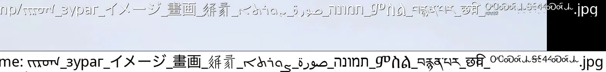
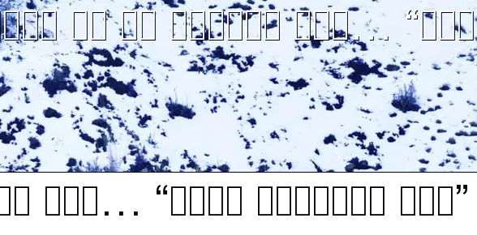
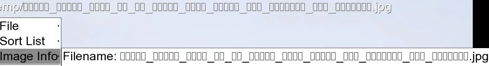

# fuh — Image Viewer with UTF-8 Filename Support

**fuh** is a fork of [feh](https://feh.finalrewind.org/), the fast and lightweight X11 image viewer.
It adds proper UTF-8 filename rendering so that filenames in non-Latin scripts — Mongolian, Tangut, Cyrillic, Chinese,
Japanese, Arabic, Hebrew, Tibetan, Amharic, emoji, and hundreds of others — display correctly instead
of showing boxes or garbled characters.

## Screenshots

**fuh — non-Latin filenames render correctly:**




**feh — same filenames show as boxes:**





## Disclaimer

This project has only been tested on Apple Silicon (macOS). It is provided as-is, with no
guarantees of correctness, stability, or fitness for any particular purpose. Use it at your
own consideration.

Linux and Intel Mac builds are not currently supported. Contributions are welcome.

## The Problem

feh renders on-screen text (filenames, menus, info overlays) using
[Imlib2](https://docs.enlightenment.org/api/imlib2/html/), which only supports ISO-8859 encodings.
Any filename containing characters outside the Latin alphabet is displayed as a row of empty boxes.

## The Fix

fuh replaces Imlib2's text rendering with a proper Unicode pipeline:

```
UTF-8 filename
    -> fontconfig   (finds the right system font for each script)
    -> HarfBuzz     (shapes glyphs: handles RTL, ligatures, cursive joining, stacking)
    -> FreeType2    (renders glyphs to pixels)
    -> Imlib2 image buffer
```

Arabic renders right-to-left with correct joining, Tibetan stacks correctly, Chinese characters
use the correct system CJK font, and every other script is handled automatically by your system's
font infrastructure — no configuration required.

## Installation

### Homebrew (macOS, recommended)

```bash
brew tap bjargal/fuh
brew install fuh
```

### Building from source (macOS, Apple Silicon)

```bash
git clone https://github.com/bjargal/fuh.git
cd fuh
make \
  CFLAGS="-I/opt/homebrew/include -I/opt/homebrew/include/freetype2 -I/opt/homebrew/include/harfbuzz -DPREFIX='\"/opt/homebrew\"' -DPACKAGE='\"fuh\"' -DVERSION='\"1.1.4\"'" \
  LDFLAGS="-L/opt/homebrew/lib -lfreetype -lfontconfig -lharfbuzz" \
  verscmp=0
```

The following additional dependencies are required beyond feh's standard ones:

| Library | Purpose |
|---|---|
| FreeType2 | Glyph rendering |
| HarfBuzz | Text shaping (RTL, ligatures, stacking) |
| fontconfig | Runtime font discovery per script |

```bash
brew install freetype harfbuzz fontconfig
```

## Usage

fuh is a drop-in replacement for feh. All feh options, keybindings and behaviour are identical.
The only differences are that text overlays now render UTF-8 correctly, and one new option is
available:

```
--font-size N    Set overlay and menu font size in pixels (default: 11)
```

Long filenames are automatically wrapped to fit the window width.

```bash
# display filename overlay
fuh --draw-filename image.jpg

# larger font
fuh --font-size 16 --draw-filename image.jpg

# slideshow
fuh --draw-filename /path/to/images/
```

See `man fuh` for full documentation.

## What has changed from feh

**`src/imlib.c`** — Core change. Adds a UTF-8 text rendering pipeline using FreeType2,
HarfBuzz, and fontconfig. Replaces `gib_imlib_text_draw()` calls in `feh_draw_filename()`
with new UTF-8-aware functions. Implements font fallback for scripts that fontconfig does not
reliably match on macOS (Tibetan via Kokonor, Amharic via Kefa, emoji via Apple Color Emoji).
Adds cluster-aware glyph rendering for stacking scripts. Adds multiline filename wrapping
based on window width.

**`src/menu.c`** — Replaces `gib_imlib_text_draw()` and `gib_imlib_get_text_size()` in the
menu rendering path so menu items with non-Latin text render correctly.

**`src/options.c` / `src/options.h`** — Adds `--font-size` command-line option.

**`src/feh.h`** — Public declarations for `feh_draw_text_utf8()` and `feh_utf8_text_width()`.

**`src/Makefile` / `Makefile`** — Output binary renamed from `feh` to `fuh`.

**`man/feh.pre`** — Documents `--font-size`, updates contacts, URLs, and copyright.

Everything else — image loading, slideshow, wallpaper setting, thumbnail generation,
keybindings — is unchanged from feh.

## Font selection

fuh selects fonts automatically at runtime:

1. User-specified font via `--font` (same as feh)
2. Best system font per codepoint via fontconfig
3. Hardcoded macOS fallbacks for scripts where fontconfig matching is unreliable:
   Tibetan (Kokonor), Amharic (Kefa), emoji (Apple Color Emoji)
4. Bundled yudit.ttf as last resort (Latin only, original feh behaviour)

## Relationship to feh

fuh tracks feh's releases. The goal is to keep the diff minimal so that upstream feh
improvements can be merged cleanly.

Upstream feh repository: https://github.com/derf/feh

The feh project does not accept AI-assisted contributions. fuh exists as a separate fork
precisely so this fix can be available to people who need it, without conflicting with
upstream's contribution policy.

## Development notes

This project was vibe-coded in [Claude](https://claude.ai) (Anthropic) in a single session.
The approach — using FreeType2, HarfBuzz, and fontconfig to replace Imlib2's text rendering —
was developed interactively, from diagnosing the root cause through to a working proof of
concept and integration into feh's source code.

## License

fuh is distributed under the same license as feh (MIT-feh).

```
Copyright (C) 1999,2000 Tom Gilbert.
Copyright (C) 2010-2025 Birte Kristina Friesel.
Copyright (C) 2025 Jargal Badagarov.
```

See [COPYING](COPYING) for the full license text.

## Name

fuh stands for feh unicode. Because sometimes things just work, and you go "fuh, finally."
